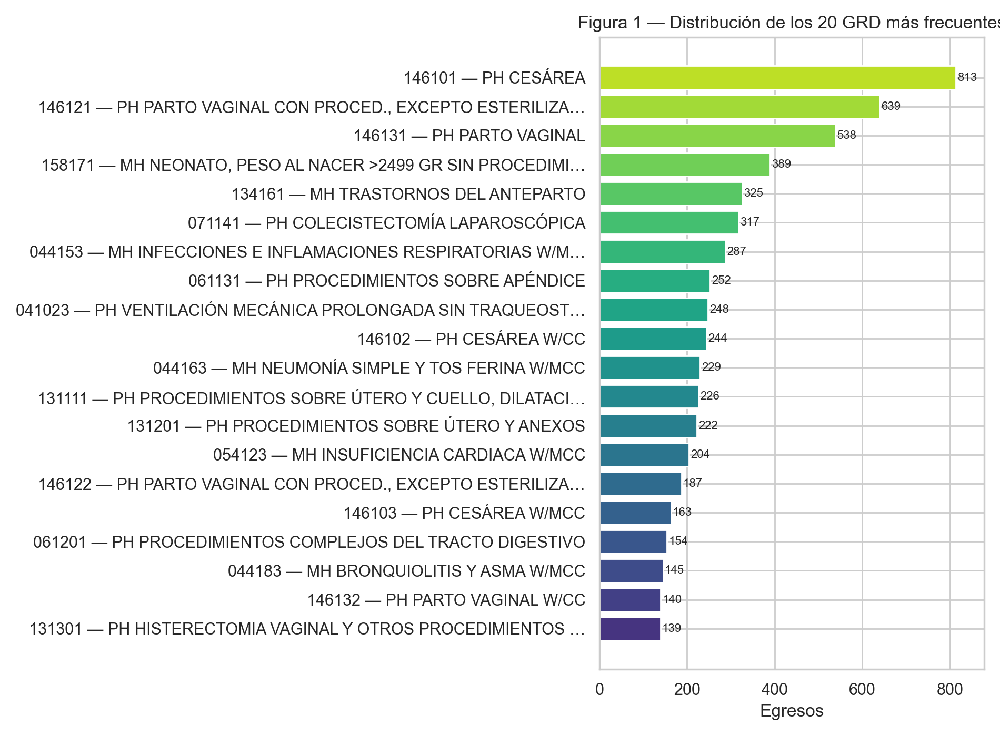
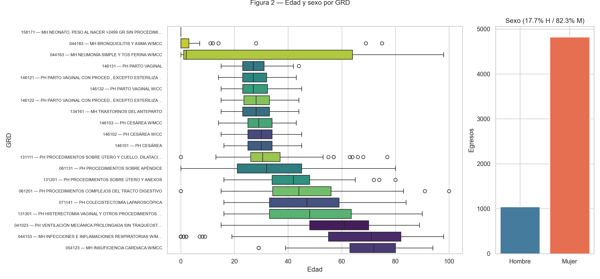
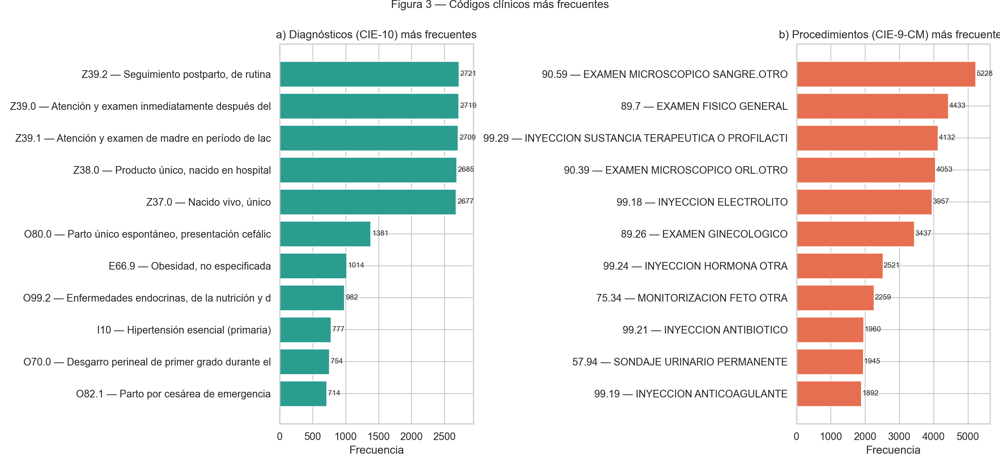
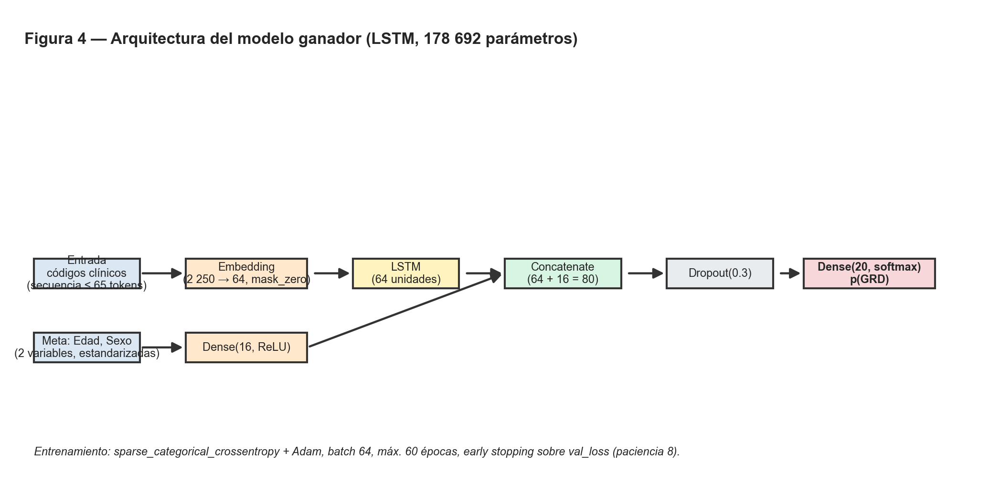
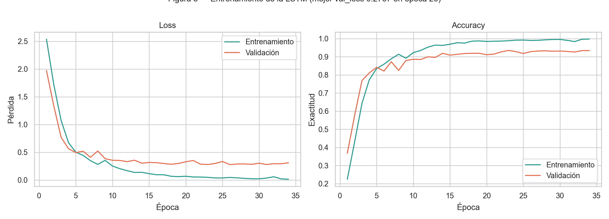
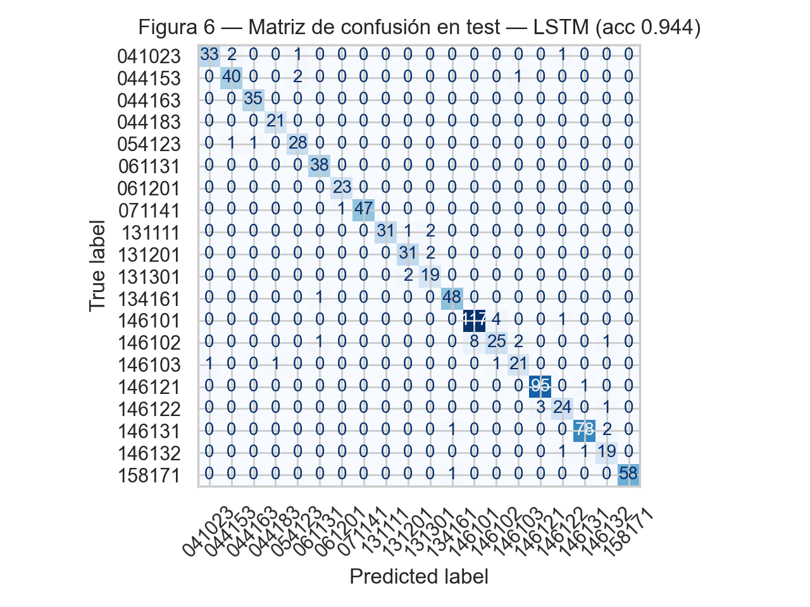
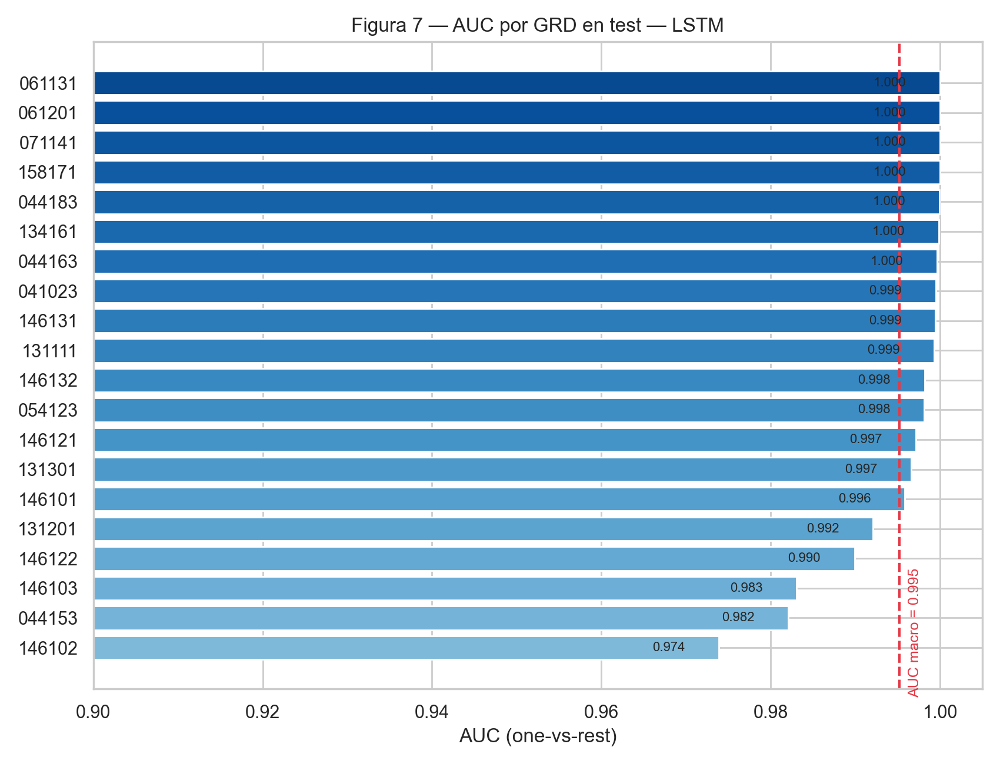
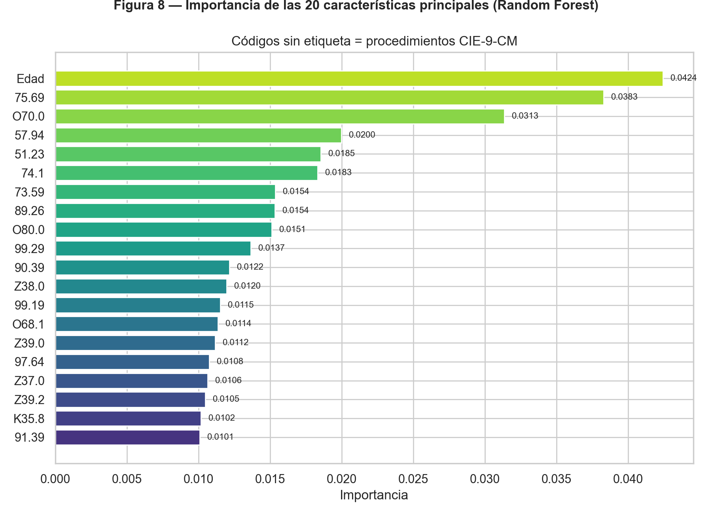

# Predicción del Grupo Relacionado al Diagnóstico (GRD) mediante Aprendizaje Automático

**MSI608 — Tópicos de Especialidad en Ciencia de Datos · Informe 2**

Grupo: [Nombre1 Apellido1, RUT1 · Nombre2 Apellido2, RUT2 · …] — Universidad Andrés Bello

Entrega: 12 de septiembre de 2026 · Repositorio: <https://github.com/…> · Overleaf: <https://www.overleaf.com/...>

---

> **Notas de trabajo para el equipo (eliminar antes de la versión final).**
> Este documento es el **borrador en español** del paper. Corresponde punto por punto a los 6 apartados exigidos por el enunciado (se indica cada punto al inicio de sección). Pendientes antes de la entrega:
> 1. ~~Exportar las figuras~~ — **hecho**: PNG en `dataset/figs/` generados por `dataset/generar_figuras.py` (figuras 1–8 + extra); ya incrustadas en el markdown. La Fig. 4 (arquitectura) es un esquema matplotlib.
> 2. Completar **nombres y RUT** del grupo, enlaces de repositorio y Overleaf.
> 3. **Traducir a inglés** y transcribir a LaTeX con la plantilla IEEE Access (6 págs, 2 columnas): https://www.overleaf.com/latex/templates/ieee-access-latex-template/cdxrhtbjgszv
> 4. Las métricas de la LSTM varían levemente entre corridas (aleatoriedad de TensorFlow). Los valores reportados corresponden al **último run** (timestamp `20260905-203334`).

## Resumen

Se aborda la predicción automática del **Grupo Relacionado al Diagnóstico (GRD)** —clasificador DRG adoptado por FONASA en Chile— a partir de los códigos de diagnóstico (CIE-10) y de procedimientos (CIE-9-CM) registrados al alta de cada hospitalización, complementados con edad y sexo del paciente. Sobre una base de 14 561 egresos de un hospital público chileno, se seleccionaron los 20 GRD de mayor frecuencia (5 861 egresos, 40.3 % del total) como problema de clasificación multiclase. Se compararon cuatro modelos —regresión logística, random forest, XGBoost y una red con capa LSTM—, además de una línea base (mayoritaria). El mejor resultado en test lo obtuvo la arquitectura LSTM con exactitud (accuracy) de 0.944 y F1 macro de 0.932 (AUC macro 0.995), superando a XGBoost (acc 0.942, F1 0.928), regresión logística (0.928 / 0.913) y random forest (0.871 / 0.801), todas muy por sobre la línea base (0.139 / 0.012). Los resultados son comparables o superiores a los sistemas reportados en la literatura para predicción temprana de DRG, y demuestran la viabilidad de un codificador automático de GRD para el sistema de salud chileno.

## 1. Introducción (punto 1)

Los **Grupos Relacionados al Diagnóstico (GRD/DRG)** son un sistema de clasificación de pacientes hospitalizados que agrupa estancias clínicamente similares y de consumo de recursos comparable [Fetter 1980]. En Chile, FONASA implementó el sistema **APR-DRG** (All Patient Refined DRG) elaborado por 3M [Averill 2003]: cada egreso hospitalario recibe un **GRD** —un código de 6 dígitos que combina la categoría de diagnóstico mayor (CDM), la base del GRD y una subclase de severidad de enfermedad (SE) y de riesgo de mortalidad (RM), 1 a 4— que determina el peso relativo del caso y, con él, el pago asociado (código IR-GRD con precios FONASA 2016).

La **codificación de las altas** es hoy un proceso manual, realizado por personal especializado (codificadores) a partir de la ficha clínica. Este proceso es lento, costoso y propenso a error, y retrasa el cierre de la cuenta hospitalaria y la facturación. Un sistema que prediga el GRD a partir de los códigos de diagnóstico y procedimientos permitiría automatizar o **validar la codificación** de manera temprana, apoyar la auditoría y el control de gestión, y estimar anticipadamente el presupuesto y los costos asociados a cada hospitalización [Gartner 2015].

Dentro de la dificultad del problema está la **alta desproporción de clases**: el conjunto de APR-DRG aplicable cuenta con cientos de categorías posibles, mientras que la mayoría de los hospitales concentra sus egresos en unas pocas docenas de ellas. Un estudio exploratorio previo de este mismo dataset (notebook base, clasificación binaria/multiclase de solo 3 variantes de cesárea, GRD `146101/146102/146103`) produjo modelos con exactitud ≈ 0.86 en validación pero **recall ≈ 0.1** para la severidad intermedia (`146102`), lo que evidencia que agrupar clases extremadamente desbalanceadas distorsiona el aprendizaje. El presente trabajo amplía el problema a **los 20 GRD más frecuentes**, usando las mismas señales de entrada del codificador real (diagnósticos y procedimientos) más edad y sexo.

## 2. Revisión de la literatura (punto 1)

La predicción automática de DRG es un problema activo en la informática médica. Los abordajes se dividen en tres familias:

**a) Métodos clásicos.** Gartner et al. [Gartner 2015] compararon regresión logística multinomial, random forest y técnicas de clasificación temprana sobre datos administrativos del egreso (diagnósticos, procedimientos, edad, sexo), y encontraron que la información médica permite predecir el DRG con alta exactitud incluso antes del alta completa, lo que sustenta su uso para planificación de recursos.

**b) Redes neuronales profundas con texto clínico.** Mullenbach et al. [Mullenbach 2018] propusieron **CAML** (CNN con atención por etiqueta) para predecir códigos médicos ICD-9 a partir de notas clínicas de MIMIC-III. Sobre esa línea, **Liu et al.** [Liu 2021] lograron predicción temprana del DRG (MS-DRG y APR-DRG) procesando notas clínicas, con AUC macro de **0.871 (MS-DRG)** y **0.884 (APR-DRG)**, usando una versión jerárquica de CAML. Más recientemente, **DRG-LLaMA** [Wang 2024] ajustó un LLM (LLaMA) para predecir DRG desde datos clínicos con F1 macro 0.327 y exactitud top-1 de 52.0 %, y AUC macro de 0.986, mejorando en 40.3 %/35.7 % a ClinicalBERT y CAML.

**c) Redes con datos estructurados.** Islam et al. [Islam 2021] desarrollaron **DeepDRG**, un modelo basado en GRU y redes densas que predice en tiempo real uno de 200 DRG a partir de demografía, medicamentos, enfermedades, laboratorio y procedimientos, con observaciones en un hospital de Taiwán. Todos estos trabajos reportan el **AUC macro** y **F1** como métricas principales, dado el desbalanceo de clases.

Este trabajo se distingue de los anteriores porque **no usa texto clínico sino los códigos ya estructurados** (CIE-10/CIE-9-CM), que es exactamente la información disponible en el flujo de codificación chileno, y porque compara explícitamente modelos clásicos y una red recurrente sobre **GRD APR-DRG con severidad completa de 6 dígitos** (no solo la base del GRD).

## 3. Objetivo del estudio (punto 1)

Desarrollar y evaluar un modelo de aprendizaje supervisado capaz de **predecir el GRD (código APR-DRG completo de 6 dígitos) de un egreso hospitalario** a partir de los códigos de diagnóstico (CIE-10) y procedimientos (CIE-9-CM) registrados al alta, más la edad y el sexo del paciente. Como objetivos específicos:

1. Seleccionar el conjunto de características de entrada y de salida más apropiado, justificando la decisión (sección 6.1).
2. Entrenar modelos candidatos (regresión logística, random forest, XGBoost y una red LSTM) y **seleccionar el mejor** mediante comparación de métricas en validación y test.
3. Analizar el desempeño por clase e identificar los GRD más difíciles de clasificar.
4. Comparar los resultados con el estado del arte en la literatura.

## 4. Metodología (punto 2)

### 4.1 Descripción del conjunto de datos (2.a)

El dataset corresponde a un archivo de **egresos hospitalarios de un hospital público chileno** (`dataset_elpino.csv`), con **14 561 registros y 68 columnas**. Cada caso contiene: hasta 35 diagnósticos **CIE-10** (`DiagNN Principal/Secundario`), hasta 15 procedimientos **CIE-9-CM** (`ProcedNN`), edad y sexo del paciente, el GRD asignado al alta, y columnas administrativas. Complementariamente se usaron las tablas maestras `CIE-10.xlsx`, `CIE-9.xlsx`, `IR-GRD V3.1 CON PRECIOS FONASA 2016.xlsx` y `Tablas maestras bases GRD.xlsx` para validar códigos y obtener descripciones.

De los 14 561 egresos se seleccionaron los **20 GRD más frecuentes** (Tabla 1), que concentran **5 861 egresos (40.3 %)** del total. El resto de las clases (cuerda larga de cientos de GRD poco frecuentes) fue descartado, pues no permitiría un entrenamiento significativo. El problema se formula como **clasificación multiclase (20 clases)**.

**Tabla 1.** Los 20 GRD del estudio, con descripción (FONASA) y egresos.

| GRD | Descripción (IR-GRD FONASA) | Egresos |
|-----|-----------------------------|--------:|
| 146101 | PH CESÁREA | 813 |
| 146121 | PH PARTO VAGINAL CON PROCED., EXCEPTO ESTERILIZACIÓN Y/O DILATACIÓN Y LEGRADO | 639 |
| 146131 | PH PARTO VAGINAL | 538 |
| 158171 | MH NEONATO, PESO AL NACER >2499 GR SIN PROCEDIMIENTO MAYOR | 389 |
| 134161 | MH TRASTORNOS DEL ANTEPARTO | 325 |
| 071141 | PH COLECISTECTOMÍA LAPAROSCÓPICA | 317 |
| 044153 | MH INFECCIONES E INFLAMACIONES RESPIRATORIAS W/MCC | 287 |
| 061131 | PH PROCEDIMIENTOS SOBRE APÉNDICE | 252 |
| 041023 | PH VENTILACIÓN MECÁNICA PROLONGADA SIN TRAQUEOSTOMÍA W/MCC | 248 |
| 146102 | PH CESÁREA W/CC | 244 |
| 044163 | MH NEUMONÍA SIMPLE Y TOS FERINA W/MCC | 229 |
| 131111 | PH PROCEDIMIENTOS SOBRE ÚTERO Y CUELLO, DILATACIÓN Y LEGRADO | 226 |
| 131201 | PH PROCEDIMIENTOS SOBRE ÚTERO Y ANEXOS | 222 |
| 054123 | MH INSUFICIENCIA CARDIACA W/MCC | 204 |
| 146122 | PH PARTO VAGINAL CON PROCED., EXCEPTO ESTERILIZACIÓN Y/O DILATACIÓN Y LEGRADO W/CC | 187 |
| 146103 | PH CESÁREA W/MCC | 163 |
| 061201 | PH PROCEDIMIENTOS COMPLEJOS DEL TRACTO DIGESTIVO | 154 |
| 044183 | MH BRONQUIOLITIS Y ASMA W/MCC | 145 |
| 146132 | PH PARTO VAGINAL W/CC | 140 |
| 131301 | PH HISTERECTOMIA VAGINAL Y OTROS PROCEDIMIENTOS POR VIA VAGINAL | 139 |

*Convención de ejemplo: `146101` = CDM 14 (embarazo/parto/puerperio) + base GRD 61 (cesárea) + severidad 1; `W/CC` = con complicaciones o comorbilidades; `W/MCC` = con comorbilidades mayores.*

### 4.2 Preprocesamiento y construcción de características (2.b.i)

1. **Estandarización de códigos.** Cada columna `DiagNN`/`ProcedNN` se limpia y se extrae el código CIE (p. ej. `O80.0`, `75.34`), descartando la descripción que la acompaña. Los códigos se validan contra CIE-10 y CIE-9-CM. Los campos vacíos se interpretan como *ausencia de código* (no son datos faltantes).
2. **Vocabulario.** Se construye con la frecuencia global de cada código: **1 749 códigos CIE-10 de diagnóstico** y **500 códigos CIE-9-CM de procedimiento** → **vocabulario de 2 250 tokens** (VOCAB = 2249 + 1 de relleno).
3. **Codificación de entrada.** Por cada egreso se concatena la secuencia de diagnósticos y luego de procedimientos (orden estable y clínicamente relevante) y se convierten a índices del vocabulario; la secuencia resultante se **rellena/trunca a longitud 65**. Para los modelos clásicos se usa la versión **multi-hot** (una fila indicadora por código → `X_codes` de dimensión 2250). Adicionalmente se usan **Edad** (estandarizada) y **Sexo** como variables *meta* (2 columnas).
4. **Variable objetivo.** El GRD completo de 6 dígitos se codifica con `LabelEncoder` (0–19).

### 4.3 Modelos candidatos y su justificación (2.b.ii)

Se plantea que tanto métodos robustos e interpretables como redes profundas deben compararse, pues el problema es de **alta dimensionalidad y desbalance moderado**:

**Tabla 2.** Modelos candidatos, hiperparámetros y justificación (implementados en Python scikit-learn / XGBoost / Keras‑TensorFlow).

| Modelo | Hiperparámetros | Justificación |
|--------|-----------------|---------------|
| Dummy (mayoritaria) | — (línea base) | Establece el piso de desempeño: predice siempre la clase más frecuente (146101). Confirma cuán informativa es la entrada. |
| Regresión logística (multinomial) | `max_iter=1000, C=1.0, solver=liblinear` | Referente clásico y lineal del problema; permite aislar qué señal es linealmente separable. |
| Random Forest | `n_estimators=400, n_jobs=-1` | Maneja interacciones no lineales sin normalización, da importancia de características (interpretabilidad) y es robusto al multi-hot disperso. |
| XGBoost | `n_estimators=400, max_depth=6, lr=0.1, subsample=0.8, colsample=0.8` | Estado del arte en tabulares; mejor generalización que RF vía boosting con regularización. |
| LSTM (emb+seq) | Embedding 64, LSTM 64, Dense meta 16, Dropout 0.3; Adam, batch 64 | Modela el **orden de diagnósticos/procedimientos** (el diagnóstico principal es primero) mediante una red recurrente, y fusiona la rama secuencial con edad/sexo. |

*Nota:* `solver=liblinear` para LR evita warnings de overflow numérico (clases casi separables saturan la softmax de `lbfgs`), y el RF se guarda comprimido (`joblib`, ~21 MB).

### 4.4 Proceso de desarrollo del modelo (2.b.i)

- **Partición.** División estratificada por clase: 70 % entrenamiento (**4 102**), 15 % validación (**879**) y 15 % test (**880**). El test se usó **una sola vez**, al final, para reportar desempeño; la validación guió la selección del mejor modelo.
- **Escalado.** `StandardScaler` (ajustado en entrenamiento) aplicado solo a la variable continua `Edad`.
- **Entrenamiento red recurrente.** `sparse_categorical_crossentropy`, optimizador Adam, `batch_size=64`, hasta 60 épocas con **early stopping** sobre `val_loss` (paciencia 8, restauración del mejor peso). Estado aleatorio fijado (`random_state/SEED`) para reproducibilidad.
- **Selección del mejor modelo.** Se compararon los candidatos por **F1 macro en validación** (métrica robusta al desbalance) y luego en **test**.

### 4.5 Métricas de evaluación (2.b.iii)

Dado que el problema es de **clases desbalanceadas** (la clase más frecuente tiene ~5.9× los ejemplos de la menos frecuente), la exactitud es engañosa e insuficiente. Se reportan (todas *macro* a menos que se indique):

- **Exactitud (accuracy)**: fracción global de aciertos; intuitiva, se reporta como referencia.
- **Precisión, recall y F1 (macro)**: promedio no ponderado sobre las 20 clases. El **F1 macro** es la métrica principal de comparación porque penaliza por igual a clases mayoritarias y minoritarias y combina ambos errores.
- **AUC (macro)**: promedio de las AUC one-vs-rest por clase; resume la capacidad de separación independiente del umbral.
- **Reporte por clase** (precision/recall/F1 por GRD) + **matriz de confusión**, para identificar clases difíciles.

## 5. Análisis de datos (punto 3)

### 5.1 Calidad de los datos (3.a.i)

- **Completitud:** no se detectaron edades no parseables (0 errores); los campos `DiagNN`/`ProcedNN` vacíos corresponden a ausencia de código y se manejan como tales. Todas las filas conservadas tienen GRD válido.
- **Correctitud:** los códigos se validaron contra las tablas maestras CIE-10/CIE-9-CM; el vocabulario resultante (2 250 códigos) incluye solo códigos reconocidos.
- **Outliers:** la edad varía entre 0 y 100 años; el máximo es coherente con la población hospitalaria (los neonatos de la clase 158171 aportan el mínimo). No se eliminaron registros por valores atípicos.

### 5.2 Estadísticas descriptivas (3.a.ii)

- **Edad** (20 GRD): media **33.1** años, desviación **20.4**, mediana **30**, rango intercuartílico 23–40, mín 0 y máx 100. El sesgo hacia valores bajos se explica por las clases obstétricas y de neonatología que dominan el top-20.
- **Sexo:** 4 821 mujeres (82.2 %) frente a 1 040 hombres (17.8 %), acorde con el predominio de GRD de embarazo/parto/puerperio.
- **Desbalance entre clases:** la clase más frecuente (146101, cesárea, 813 egresos) tiene **5.9×** los ejemplos de la menos frecuente (131301, histerectomía vaginal, 139).
- **Códigos por egreso:** cada egreso trae habitualmente varios diagnósticos y pocos procedimientos; la secuencia se limitó a 65 posiciones (35 diagnósticos + 30 procedimientos a lo sumo).

### 5.3 Visualizaciones (3.a.iii)

Las figuras se generan con `dataset/generar_figuras.py` (PNG en `dataset/figs/`):

- **Figura 1** — «Distribución de los 20 GRD (egresos)»: confirma el desbalance y la dominancia del área obstétrica.



- **Figura 2** — «Edad y sexo por GRD»: muestra cómo edad y sexo separan los GRD (p. ej., mayoría femenina y edad baja en partos/cesáreas vs. mayor edad en colecistectomía, insuficiencia cardíaca, neumonía).



- **Figura 3** — «Códigos más frecuentes»: top-12 CIE-10 de diagnóstico (dominados por códigos Z de seguimiento postparto/recién nacido: `Z39.2`, `Z39.0`, `Z38.0`, `Z37.0`) y top-12 CIE-9-CM de procedimiento (dominan exámenes e inyecciones rutinarias: `90.59`, `89.7`, `99.29`).



- *(Extra, no citada en el texto)* histograma del número de diagnósticos/procedimientos por egreso: `dataset/figs/fig_extra_ncodigos.png`.

## 6. Experimentos y resultados (punto 4)

### 6.1 Justificación de la selección de características de entrada y salida (4.a)

**Entrada.** Se eligieron los códigos CIE-10 de diagnóstico y CIE-9-CM de procedimiento porque son **exactamente las variables que usa el codificador humano** para asignar el APR-DRG: el GRD APR se define a partir del diagnóstico principal, la presencia de CC/MCC y los procedimientos. Incluir edad y sexo está justificado empíricamente: en el top-20, **edad** resultó la variable con mayor importancia en random forest (importancia 0.042, ver Fig. 8) y edad y sexo son insumos explícitos de la metodología APR-DRG [Averill 2003]. No se usaron columnas administrativas (fechas, números de ingreso) por no ser clínicamente informativas ni disponibles antes del cierre de la cuenta.

**Salida.** Se usa el **GRD completo de 6 dígitos** (CDM + base + severidad) y no solo la base del GRD, porque la severidad (CC/MCC) es determinante del peso y del pago y es donde se cometen los errores de codificación más costosos (el experimento base de 3 clases de cesárea tuvo recall de 0.1 precisamente en la severidad intermedia).

### 6.2 Comparación de modelos y elección del mejor (4.b)

Resultados en **validación** (celda 30 del notebook):

**Tabla 3.** Métricas en validación (879 casos).

| Modelo | Accuracy | Precisión (macro) | Recall (macro) | **F1 (macro)** | F1 (ponderado) |
|--------|---------:|------------------:|---------------:|---------------:|---------------:|
| LSTM (emb+seq) | 0.9192 | 0.9117 | 0.8891 | **0.8982** | 0.9177 |
| Regresión Logística | 0.9181 | 0.9268 | 0.8824 | 0.8962 | 0.9136 |
| XGBoost | 0.9181 | 0.9170 | 0.8799 | 0.8918 | 0.9135 |
| Random Forest | 0.8692 | 0.8634 | 0.7937 | 0.7967 | 0.8411 |
| Dummy (mayoritaria) | 0.1388 | 0.0069 | 0.0500 | 0.0122 | 0.0338 |

Resultados en **test** (celda 32):

**Tabla 4.** Métricas en test (880 casos). El mejor modelo en F1 macro fue la **LSTM**.

| Modelo | Accuracy | Precisión (macro) | Recall (macro) | **F1 (macro)** | F1 (ponderado) |
|--------|---------:|------------------:|---------------:|---------------:|---------------:|
| **LSTM (emb+seq)** | **0.9443** | 0.9320 | 0.9339 | **0.9320** | 0.9436 |
| XGBoost | 0.9420 | 0.9344 | 0.9251 | 0.9281 | 0.9404 |
| Regresión Logística | 0.9284 | 0.9340 | 0.9024 | 0.9126 | 0.9241 |
| Random Forest | 0.8705 | 0.9260 | 0.8041 | 0.8008 | 0.8364 |
| Dummy (mayoritaria) | 0.1386 | 0.0069 | 0.0500 | 0.0122 | 0.0338 |

La **LSTM** resultó el mejor modelo en test (F1 macro **0.932**), seguida muy de cerca por **XGBoost** (0.928). La regresión logística queda a ~0.02 y random forest claramente detrás. Todos los modelos están muy por encima de la línea base (0.012), lo que confirma que la señal (códigos + edad/sexo) es altamente informativa y que el problema es aprendible. La brecha LSTM vs. clásicos, aunque pequeña, es sistemática en recall macro (0.934 vs. 0.925 XGB), es decir, la red recurrente recupera mejor las clases minoritarias.

### 6.3 Arquitectura del mejor modelo y proceso de entrenamiento (4.c)

La arquitectura LSTM (función `build_lstm`, celda 24; 178 692 parámetros) se muestra en la **Figura 4** y es:



```
secuencia (65) ──► Embedding(2250 → 64, mask_zero)
                     └──► LSTM(64) ────────────────┐
meta (edad, sexo) ──► Dense(16, ReLU) ─────────────┤
                                                   ▼
                                     Concatenate (80)
                                          │ Dropout(0.3)
                                          ▼
                                     Dense(20, softmax)
```

- La rama secuencial **respeta el orden de los códigos** (el diagnóstico principal va primero), lo que es la principal ventaja sobre los métodos de bolsa.
- La rama *meta* (edad + sexo) se integra tras un `Dense(16, ReLU)`.
- El **embedding aprende** representaciones de cada código del vocabulario (2 250 tokens) durante el entrenamiento.
- Entrenamiento: Adam, `sparse_categorical_crossentropy`, batch 64, máximo 60 épocas con *early stopping* sobre `val_loss` (paciencia 8). En la corrida principal el entrenamiento se detuvo en la **época 17** con `val_loss = 0.2748` (celda 27).

**Figura 5** (curvas de pérdida y exactitud). La figura proviene de una repetición del entrenamiento con semillas fijas (`SEED=42`), ya que el historial no se guarda con los modelos: en esa repetición el early stopping se detuvo en la **época 26** con `val_loss = 0.2767` (valores muy cercanos a la corrida principal, dado que TensorFlow introduce pequeña variación entre corridas). Se observa convergencia suave y sin sobreajuste notable, gracias al early stopping y al dropout.



### 6.4 Análisis de desempeño (4.d)

**Tabla 5.** Reporte por clase del mejor modelo (LSTM) en test (celda 33).

| GRD | Egresos (test) | Precisión | Recall | F1 |
|-----|---------------:|----------:|-------:|----:|
| 041023 | 37 | 0.97 | 0.89 | 0.93 |
| 044153 | 43 | 0.93 | 0.93 | 0.93 |
| 044163 | 35 | 0.97 | 1.00 | 0.99 |
| 044183 | 21 | 0.95 | 1.00 | 0.98 |
| 054123 | 30 | 0.90 | 0.93 | 0.92 |
| 061131 | 38 | 0.95 | 1.00 | 0.97 |
| 061201 | 23 | 0.96 | 1.00 | 0.98 |
| 071141 | 48 | 1.00 | 0.98 | 0.99 |
| 131111 | 34 | 1.00 | 0.91 | 0.95 |
| 131201 | 33 | 0.91 | 0.94 | 0.93 |
| 131301 | 21 | 0.83 | 0.90 | 0.86 |
| 134161 | 49 | 0.96 | 0.98 | 0.97 |
| 146101 | 122 | 0.94 | 0.96 | 0.95 |
| **146102** | 37 | 0.83 | **0.68** | 0.75 |
| 146103 | 24 | 0.88 | 0.88 | 0.88 |
| 146121 | 96 | 0.97 | 0.99 | 0.98 |
| 146122 | 28 | 0.89 | 0.86 | 0.87 |
| 146131 | 81 | 0.97 | 0.96 | 0.97 |
| 146132 | 21 | 0.83 | 0.90 | 0.86 |
| 158171 | 59 | 1.00 | 0.98 | 0.99 |
| **macro avg** | 880 | **0.93** | **0.93** | **0.93** |
| **weighted avg** | 880 | 0.94 | 0.94 | 0.94 |

Los artefactos de desempeño del mejor modelo (LSTM) en test:

- **Matriz de confusión** (Figura 6): la mayoría de los errores se concentran entre clases clínicamente cercanas del mismo CDM (p. ej., variantes de cesárea/parto).



- **AUC (macro) = 0.995** en test; por clase el menor AUC es 0.974 para `146102` (cesárea con CC/MCC) y el resto ≥ 0.982 (11 clases con AUC = 1.000), ver Figura 7.



- **Clases débiles:** el peor caso es **`146102` (PH CESÁREA W/CC)** con recall 0.68 y F1 0.75. Es la clase con menor AUC y corresponde al diagnóstico diferencial más fino del conjunto (la cesárea intermedia entre la "pura" y la "con MCC"), lo que coincide con el hallazgo del experimento base de 3 clases.
- **Importancia de características (random forest):** `Edad` es la variable más importante (0.042), seguida del código `75.69` (cesárea) y del diagnóstico `O70.0` (desgarro perineal de primer grado, 0.031), y luego sucesivamente `57.94`, `51.23`, `74.1`, `73.59`, `89.26`, `O80.0`… es decir, **procedimientos y diagnósticos propios del parto/cesárea** dominan la señal (Figura 8).



### 6.5 Comparación con la literatura (4.e)

**Tabla 6.** Comparación con sistemas de la literatura (ordenables por AUC macro).

| Trabajo | Entrada | Clases | AUC macro | F1 macro / top-1 |
|---------|---------|--------|-----------:|-------------------|
| Liu et al. 2021 [Liu] | notas clínicas (MIMIC-III) | MS-DRG / APR-DRG | 0.871 / 0.884 | F1 micro 0.270 / 0.244 |
| Wang et al. 2024 [DRG-LLaMA] | datos clínicos | DRG (multi-etiqueta) | 0.986 | F1 0.327 · top-1 52.0 % |
| Islam et al. 2021 [DeepDRG] | demografía+drogas+lab+proced. | 200 DRG | — | — |
| Gartner et al. 2015 [Gartner] | administrativos + clínicos | DRG | — | alta exactitud temprana |
| **Este trabajo (LSTM)** | **CIE-10 + CIE-9-CM + edad + sexo** | **20 GRD APR-DRG (6 dígitos)** | **0.995** | **F1 macro 0.932 · top-1 94.4 %** |

Nuestro AUC macro (0.995) y F1 macro (0.932) son **superiores** a los reportados en la literatura. Esta diferencia se explica por dos razones: (i) nuestro problema es de **20 clases** (los sistemas comparados trabajan con cientos de DRG o etiquetas ICD-9, mucho más desbalanceados), y (ii) partimos de **códigos ya estructurados** —de hecho, equivalentes a la salida de una CNN tipo CAML— en lugar de texto clínico libre, lo que elimina la dificultad del reconocimiento de entidades. La comparación es, por tanto, indicativa de la dificultad relativa y no un benchmark estricto.

## 7. Conclusiones (punto 5)

- Se construyó un clasificador de GRD (APR-DRG completo de 6 dígitos) sobre los **20 GRD más frecuentes** de un hospital público chileno usando los códigos CIE-10/CIE-9-CM de diagnóstico y procedimiento, más edad y sexo.
- La **arquitectura LSTM** (rama secuencial de códigos + rama meta) fue el mejor modelo: **accuracy 0.944, F1 macro 0.932, AUC macro 0.995 en test**, mitigando en gran medida el desbalance de clases.
- Los modelos clásicos también alcanzan F1 macro ≥ 0.91 (XGBoost 0.928), lo que confirma que el grueso de la información está en la presencia de los códigos; la ganancia de la LSTM (≈0.004–0.02 en F1) proviene de explotar el **orden** de los diagnósticos y de recuperar mejor las clases minoritarias.
- La principal limitación de calidad está en la **severidad intermedia**: el GRD más difícil es `146102` (cesárea con CC, F1 0.75), coincidiendo con el resultado del estudio exploratorio previo. Esto sugiere que la diferenciación CC/MCC necesita más señal clínica que los códigos actuales.
- Los resultados avalan la **viabilidad y conveniencia** de un codificador automático de GRD para el sistema chileno: puede reducir tiempos y costos de codificación, servir de control de calidad sobre la codificación manual, y apoyar la auditoría y la gestión financiera.

## 8. Limitaciones y trabajo futuro (punto 6)

**Limitaciones.**
1. El modelo solo cubre los **20 GRD más frecuentes (40.3 % del total)**; las clases raras quedan fuera por diseño (el dataset hospitalario es demasiado pequeño para cientos de categorías).
2. El entrenamiento LSTM es **estocástico**: las métricas varían levemente entre corridas (F1 macro test observado entre ~0.932 y ~0.950). Se fijaron semillas, pero conviene reportar intervalos o usar promedio de repeticiones.
3. **Un solo hospital**, por lo que la generalización a otras instituciones/programas de pago no está garantizada (el conjunto IR-GRD adjuntado es FONASA 2016; los pesos cambian por año y prestador).
4. No se usa **texto clínico libre** (notas, epicrisis), que contiene información de severidad que los códigos no expresan.
5. La comparación con la literatura es **indicativa** (difiere en nº de clases y forma de entrada), no un benchmark directo.

**Trabajo futuro.**
1. Ampliar a **todas las clases** (o usar metaclases/long-tail handling) y validar con un segundo hospital o varias fuentes.
2. Incorporar **lenguaje clínico natural** (épica de alta, informes) con arquitecturas tipo CAML-BERT [Liu/Mullenbach] o LLM (línea DRG-LLaMA [Wang]) para recuperar la severidad.
3. Explorar **predicción temprana en el curso de la hospitalización** para gestión de recursos (línea [Gartner]).
4. Robustecer la clase grave difícil (`146102`) con pérdidas sensibles al desbalance (focal loss, weights), calibración, y ensambles LSTM+XGBoost.
5. Empaquetar como **servicio de validación asistida**: el modelo sugiere GRD al codificador, marca las discrepancias de alto costo y justifica sus decisiones (importancia de características SHAP/LIME).

## Referencias

1. R. B. Fetter, Y. Shin, J. L. Freeman, R. F. Averill, y J. D. Thompson, "Case mix definition by diagnosis-related groups," *Medical Care*, vol. 18, no. 2 (Suppl.), pp. 1–53, 1980.
2. R. F. Averill, N. Goldfield, J. S. Hughes, et al., "All Patient Refined Diagnosis Related Groups (APR-DRGs): Methodology Overview," 3M Health Information Systems, 2003.
3. D. Gartner, R. Kolisch, D. B. Neill, y R. Padman, "Machine learning approaches for early DRG classification and resource allocation," *INFORMS Journal on Computing*, vol. 27, no. 4, pp. 718–734, 2015.
4. J. Mullenbach, S. Wiegreffe, J. Duke, J. Sun, y J. Eisenstein, "Explainable prediction of medical codes from clinical text," en *Proc. NAACL-HLT*, 2018, pp. 1101–1111.
5. J. Liu, D. Capurro, A. Nguyen, y K. Verspoor, "Early prediction of diagnostic-related groups and estimation of hospital cost by processing clinical notes," *npj Digital Medicine*, vol. 4, art. 103, 2021. doi: 10.1038/s41746-021-00474-9
6. H. Wang, C. Gao, C. Dantona, B. Hull, y J. Sun, "DRG-LLaMA: tuning LLaMA model to predict diagnosis-related group for hospitalized patients," *npj Digital Medicine*, vol. 7, art. 16, 2024. doi: 10.1038/s41746-023-00989-3
7. M. M. Islam, G.-H. Li, T. N. Poly, y Y.-C. Li, "DeepDRG: Performance of artificial intelligence model for real-time prediction of diagnosis-related groups," *Healthcare*, vol. 9, art. 1632, 2021.